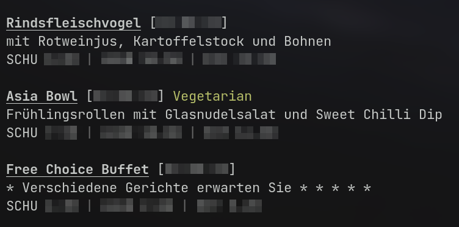

# Menu CLI

This is a cli that is used to retrieve menu data from the [menu api](https://github.com/VirtBad/menu-api). It can fetch
menus for today, tomorrow, or any other date.

## Screenshot



## Usage

After a normal installation, the CLI is available under the ```menu``` command. The CLI should be self-explanatory. To
start off, you could just run

```shell
menu --help
```

## Installation

To install it from binaries, download one for your OS (Linux x64, Windows x64) from the release section. After that, put
it to a location that is included in the path, depending on the OS, this may be different (e.g. on Linux  ```/bin```).

To install it from source on linux, the most simple way is to have the rust compiler installed, to clone this repository
and run ```./install.sh``` in its directory.

Alternatively, you could also install it manually using the following two commands:

```shell
cargo build --release
mv target/release/menu-cli /bin/menu # Any other destination may be chosen
```

## Configuration

Upon first usage of the cli, an installation wizard prompting the necessary config is executed automatically. So there
is no need to touch the config manually.

Anyway, to configure the theming of the messages can be configured over the config located
at ```[os-config-dir]/menu-cli/menu-cli.toml```.

```toml
# These two entries are set automatically by the startup wizard.
api_remote = '' # your api url
website_remote = '' # your website url

display_links = false # whether to show links to view the menus on the website

# these config entries can customize the format of the shown menus. Their usage is really straight forward.
# on the ansi fields, a special syntax is required, as shown below
[format]
title_ansi = '1;4'
date_format = '[%d.%m.%y]'
date_ansi = '0'
label_text = ['Vegetarian', 'Vegan', 'One Climate']
label_ansi = ['32', '92', '31']
description_ansi = '0'
description_width = 55
id_ansi = '90;3'
price_separator = ' | '
price_separator_ansi = '90'
price_amount_ansi = '0'
price_group_ansi = '0'
link_ansi = '0'
not_found_text = 'No menus found!'
not_found_ansi = '90'
```

### Ansi Fields

The ansi fields are fields in the configuration that are used to configure the look of the cli. Their usage is
surprisingly simple. String is multiple ansi options, which are chained together usig semicolons as here:

```
[ansi-option-1];[ansi-option-2]...
```

The available Options depend on the terminal emulator and can be found here:

* [Colours and Styles on Wikipedia](https://en.wikipedia.org/wiki/ANSI_escape_code#SGR_(Select_Graphic_Rendition)_parameters)

## Related Projects

* [menu-api](https://github.com/virtbad/menu-api)
* [menu-website](https://github.com/virtbad/menu-website)
* [menu-updater](https://github.com/virtbad/menu-updater)
* [menu-telegram-bot](https://github.com/virtbad/menu-telegram-bot)

## License

Coming Soon.